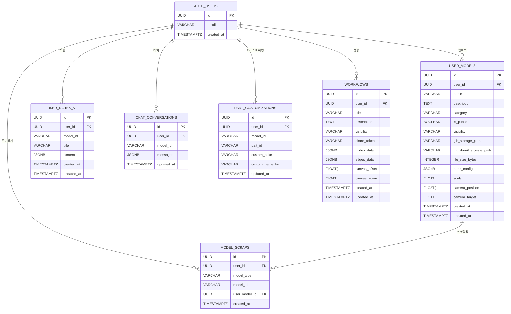

# ⚙️ SIMVEX — 3D 기계 부품 학습 플랫폼

> **"3D로 배우는 공학의 구조"**

---

## 🔩 프로젝트 개요

### 1. 기획의도

- 공대생 및 기계/로봇공학 입문자에게 기계 부품의 구조와 원리를 직관적으로 이해할 수 있는 환경이 부족함
- 기존 학습 자료는 2D 도면이나 텍스트 위주로 구성되어 3차원적 이해에 한계가 있음
- GLB 기반 3D 뷰어와 AI 어시스턴트를 결합하여 상호작용형 공학 학습 경험 제공
- **드론, 로봇팔, 판스프링, V4 엔진** 등 실제 기계 모델을 분해/조립하며 부품 구조 학습

---

## 💡 프로젝트의 목적

> "3D 모델의 분해·조립 인터랙션, AI 채팅, 퀴즈, 워크플로우 차트를 통해
> 공학 입문자가 기계 구조를 시각적으로 학습할 수 있는 웹 플랫폼 구축"

### ⚙️ 제공하는 기능

- **3D 모델 뷰어** : GLB 기반 3D 모델을 브라우저에서 회전·줌·선택 조작
- **분해/조립 슬라이더** : 0~100% 슬라이더로 완제품 ↔ 분해도 실시간 전환
- **부품 정보 조회** : 부품 클릭·호버 시 이름·역할·재질 정보 표시
- **AI 어시스턴트** : OpenAI 기반 채팅으로 현재 모델/부품 맥락 학습 질의응답
- **리치 텍스트 노트** : Tiptap 기반 에디터, 이미지·부품 태그 삽입, Supabase 동기화
- **퀴즈** : 객관식·O/X·부품 클릭 문제, AI 자동 생성 지원
- **워크플로우 차트** : 노드-엣지 기반 학습 플로우차트, AI 자동 생성·공유
- **사용자 모델 업로드** : GLB/FBX 파일 업로드 후 분해 설정 자동 생성 및 뷰어 연동
- **PDF 출력** : 3D 스크린샷 + 모델 정보 + 부품 목록 + 노트 문서화
- **단면도 보기** : X/Y/Z 축 단면 슬라이서
- **X-Ray 모드** : 전체 부품 투명도 조절
- **부품 그룹핑** : 트리 구조로 부품 정리·토글

---

## 🎬 구현 화면

### 3D 분해/조립 인터랙션
> 슬라이더로 드론 모델 분해 → 부품 클릭 → 정보 표시

https://github.com/user-attachments/assets/3616f66b-1f20-4163-b441-914a35aca630

### AI 채팅 어시스턴트
> 현재 모델/부품 컨텍스트 기반 AI 학습 질의응답, 스트리밍 응답

https://github.com/user-attachments/assets/a93556cb-4d91-4dbc-a1da-293148412ebc

### 퀴즈 (AI 자동 생성)
> 객관식·O/X·부품 클릭 문제, AI 자동 생성 및 해설

https://github.com/user-attachments/assets/0400e85c-4665-4a84-a1f9-b7875175ea06

### 단면도 + X-Ray
> X/Y/Z 축 단면 슬라이싱 및 부품 투명도 조절

https://github.com/user-attachments/assets/035d788b-1e35-4a02-afa0-3cb4f0d2b484

### 사용자 모델 업로드
> GLB/FBX 드래그앤드롭 → 자동 분해 설정 → 미리보기 → 뷰어 연동

https://github.com/user-attachments/assets/cd44c6e1-99f0-40d3-bbe9-056ff9087482

### 워크플로우 차트
> 노드-엣지 캔버스에서 학습 플로우 구성, AI 자동 생성 및 공유

https://github.com/user-attachments/assets/78933c00-4fe5-4265-a061-f00918c90d21

---

## 😎 프로젝트 소개

### 1. 개발자 소개

| 이름 | 역할 |
|------|------|
| 조창래 | 풀스택 개발 (기획 · 설계 · 프론트엔드 · 배포) |
| 이환희 | 풀스택 개발 (기획 · 설계 · 백엔드 · 배포) |

### 2. 개발 기간

- 2026.01 ~ 2026.02.11 (해커톤)

---

## 🛠 기술 스택

### Frontend

| 분류 | 기술 |
|------|------|
| 프레임워크 | Next.js 16 (App Router), React 19 |
| 언어 | TypeScript |
| 3D 그래픽 | Three.js 0.182, @react-three/fiber, @react-three/drei |
| 상태관리 | Zustand (localStorage 영속성) |
| 스타일 | Tailwind CSS 4 |
| 에디터 | Tiptap (리치 텍스트, 커스텀 확장) |
| PDF | jsPDF + html2canvas |

### Backend / BaaS

| 분류 | 기술 |
|------|------|
| 인증 | Supabase Auth (이메일/비밀번호) |
| 데이터베이스 | Supabase PostgreSQL |
| 스토리지 | Supabase Storage (GLB + 썸네일) |
| AI | OpenAI API (GPT-5-nano/mini) |
| API 라우트 | Next.js Route Handlers (13개) |

### Infrastructure

| 분류 | 기술 |
|------|------|
| 배포 | Vercel |
| 3D 에셋 | Maya → GLB (통합 메시 방식) |
| FBX 변환 | Three.js FBXLoader + GLTFExporter (브라우저) |
| 썸네일 | html2canvas (자동 캡처) |

---

## 🗂 ERD



---

## 📁 프로젝트 구조

```
simvex-web/
├── CLAUDE.md                     # 프로젝트 지침서
├── docs/                         # PRD 문서 (Phase 1~6)
├── etc/
│   ├── 3D Asset/                 # 원본 GLB 모델 파일 (Maya 원본)
│   └── 3D Asset modify/          # 통합 GLB 변환 파일
└── simvex/                       # Next.js 메인 프로젝트
    ├── public/
    │   └── models/               # 6개 통합 GLB + 61개 개별 GLB
    │       ├── drone-combined/       # 드론 통합 (36부품)
    │       ├── robot-arm-combined/   # 로봇팔 통합 (10부품)
    │       ├── leaf-spring-combined/ # 판스프링 통합 (11부품)
    │       ├── v4-engine-combined/
    │       ├── robot-gripper-combined/
    │       └── machine-vice-combined/
    ├── supabase/
    │   └── migrations/           # DB 마이그레이션 SQL
    └── src/
        ├── app/
        │   ├── page.tsx              # 랜딩페이지 (/)
        │   ├── models/page.tsx       # 모델 카탈로그 (/models)
        │   ├── community/page.tsx    # 커뮤니티 모델 (/community)
        │   ├── mypage/page.tsx       # 마이페이지 (/mypage)
        │   ├── viewer/[model]/page.tsx  # 동적 뷰어 (/viewer/:model)
        │   ├── upload/page.tsx       # 모델 업로드 (/upload)
        │   ├── workflow/             # 워크플로우 (/workflow)
        │   │   ├── page.tsx
        │   │   ├── [id]/page.tsx
        │   │   └── s/[shareToken]/page.tsx
        │   ├── auth/
        │   │   ├── login/page.tsx
        │   │   └── callback/route.ts
        │   └── api/                  # AI API 라우트 (13개)
        │       ├── chat/route.ts
        │       ├── quiz/generate/route.ts
        │       ├── quiz/explain/route.ts
        │       ├── workflow/generate/route.ts
        │       ├── assembly/recommend/route.ts
        │       ├── compare/route.ts
        │       ├── fault/diagnose/route.ts
        │       ├── flashcard/generate/route.ts
        │       ├── guide/generate/route.ts
        │       ├── narration/route.ts
        │       ├── notes/enhance/route.ts
        │       ├── report/generate/route.ts
        │       └── export/summarize/route.ts
        ├── components/
        │   ├── viewer/           # 3D 뷰어 컴포넌트
        │   │   ├── CombinedGLBPart.tsx   # 메인 통합 GLB 뷰어
        │   │   ├── ExplodeSlider.tsx
        │   │   ├── CrossSectionSlider.tsx
        │   │   ├── PartTreePanel.tsx
        │   │   └── MeasurementOverlay.tsx
        │   ├── ai/               # AI 채팅 패널
        │   ├── notes/            # 노트 에디터 (Tiptap)
        │   ├── quiz/             # 퀴즈 UI
        │   ├── workflow/         # 워크플로우 캔버스·노드
        │   ├── upload/           # 모델 업로드 UI
        │   ├── ar/               # AR 뷰어 (WebXR)
        │   ├── export/           # PDF 내보내기
        │   └── auth/             # 인증 버튼
        ├── data/
        │   ├── models/           # 모델 설정 (부품 정보, 분해 설정)
        │   └── quizzes/          # 퀴즈 데이터 (모델별)
        ├── hooks/                # 커스텀 훅
        │   ├── useUser.ts
        │   ├── useUserModels.ts
        │   ├── useNotes.ts
        │   ├── useSupabaseChat.ts
        │   ├── useScraps.ts
        │   ├── useAnnotations.ts
        │   └── useWorkflows.ts
        ├── lib/
        │   ├── supabase/         # Supabase 클라이언트 (브라우저/SSR)
        │   ├── upload/           # FBX→GLB 변환, 자동 분해 설정, 썸네일
        │   ├── export/           # PDF 생성
        │   ├── tiptap/           # 커스텀 에디터 확장
        │   └── store/            # Zustand 스토어 (6개)
        └── types/                # TypeScript 타입 정의
```

---

## 🚀 로컬 실행 방법

```bash
cd simvex
npm install
npm run dev   # http://localhost:3000
```

> ⚠️ `.env.local`에 아래 환경 변수 설정 필요

```env
OPENAI_API_KEY=sk-proj-...
NEXT_PUBLIC_SUPABASE_URL=https://your-project.supabase.co
NEXT_PUBLIC_SUPABASE_ANON_KEY=eyJhbGci...
```

---

## 📌 주요 구현 포인트

- **통합 GLB 방식** : 단일 GLB 파일에서 메시 이름으로 부품 식별, 1회 로딩으로 전체 부품 렌더링. Three.js는 메시 이름에서 콜론(`:`) 등 특수문자 자동 제거
- **분해/조립 애니메이션** : `explodeDirection × explodeDistance × sliderValue`로 각 부품 위치 계산, 부드러운 선형 보간
- **부품 선택 하이라이트** : `MeshStandardMaterial.emissive` 색상으로 클릭·호버 피드백
- **단면도 보기** : Three.js `Plane` 클리핑으로 X/Y/Z 축 실시간 단면 슬라이싱
- **FBX → GLB 브라우저 변환** : `FBXLoader`로 파싱 후 `GLTFExporter`로 변환, 서버 불필요
- **자동 분해 설정 생성** : 업로드된 GLB에서 메시 바운딩박스 분석, 무게중심 기준 방향 자동 계산
- **Tiptap 리치 노트** : 커스텀 `PartTagExtension`으로 3D 부품을 노트에 인라인 태그로 삽입
- **Zustand 영속성** : `skipHydration: true` + 클라이언트 수동 `rehydrate()`로 SSR 하이드레이션 이슈 방지
- **AI 다기능 통합** : 채팅·퀴즈 생성·워크플로우 생성·고장진단·플래시카드 등 13개 API 라우트
- **AR 뷰어** : WebXR Device API 기반 `@react-three/xr`로 모바일 AR 오버레이

---

## 📊 구현 현황

### ✅ 완료

| # | 기능 |
|---|------|
| 1 | 3D 모델 뷰어 (GLB 로딩, 조명, 그리드, 배경) |
| 2 | 분해/조립 슬라이더 (0~100%) |
| 3 | 부품 클릭/호버 선택 + 정보 표시 |
| 4 | 홈페이지 모델 카드 (썸네일 슬라이드쇼) |
| 5 | 노트 패널 (Tiptap 에디터, 이미지·부품 태그, Supabase 동기화) |
| 6 | AI 어시스턴트 (GPT-5-nano, 스트리밍, 모델/부품 컨텍스트) |
| 7 | 퀴즈 (객관식·O/X·부품 클릭, AI 자동 생성) |
| 8 | 워크플로우 차트 (노드-엣지 캔버스, AI 생성, 공유) |
| 9 | PDF 출력 (3D 스크린샷 + 모델정보 + 노트) |
| 10 | 사용자 모델 업로드 (GLB/FBX, 자동 분해 설정, 썸네일) |
| 11 | 커뮤니티 모델 섹션 (공개 모델 목록) |
| 12 | Supabase 인증 (이메일/비밀번호, 세션 미들웨어) |
| 13 | 다크모드 / 라이트모드 (Zustand 영속성) |
| 14 | 뷰 상태 저장 (카메라·분해도·선택부품 모델별 localStorage) |
| 15 | 단면도 보기 (X/Y/Z 축 클리핑) |
| 16 | X-Ray 모드 (전체 투명도 조절) |
| 17 | 부품 그룹핑 (트리 구조) |
| 18 | 즐겨찾기 (모델 스크랩) |
| 19 | 마이페이지 (업로드 모델 관리) |
| 20 | AR 뷰어 (WebXR, 모바일) |

### ⚠️ 부분 완료

- **3D 모델**: V4 엔진·로봇 집게·공작 바이스 설정 파일 존재, 홈페이지 미노출 (통합 GLB 미제작)
- **퀴즈 데이터**: 드론 모델 10문제 내장, 나머지 모델은 AI 자동 생성으로 대체

---

## 🗺 라우트 맵

| 경로 | 설명 |
|------|------|
| `/` | 랜딩페이지 |
| `/models` | 모델 카탈로그 |
| `/community` | 커뮤니티 공개 모델 |
| `/viewer/[model]` | 기본 모델 뷰어 (예: `/viewer/drone-combined`) |
| `/viewer/u-[uuid]` | 사용자 업로드 모델 뷰어 |
| `/upload` | 모델 업로드/관리 (로그인 필요) |
| `/workflow` | 워크플로우 목록 |
| `/workflow/[id]` | 워크플로우 에디터 |
| `/workflow/s/[shareToken]` | 공유 워크플로우 (뷰 전용) |
| `/mypage` | 마이페이지 |
| `/auth/login` | 로그인/회원가입 |

---

## 🤖 AI 기능 목록

| API 경로 | 기능 |
|---------|------|
| `/api/chat` | AI 채팅 (모델/부품 컨텍스트 포함) |
| `/api/quiz/generate` | 퀴즈 자동 생성 |
| `/api/quiz/explain` | 퀴즈 문제 해설 |
| `/api/workflow/generate` | 워크플로우 자동 생성 |
| `/api/assembly/recommend` | 조립 순서 추천 |
| `/api/compare` | 부품 간 비교 분석 |
| `/api/fault/diagnose` | 고장 진단 |
| `/api/flashcard/generate` | 플래시카드 생성 |
| `/api/guide/generate` | 학습 가이드 생성 |
| `/api/narration` | 텍스트-음성 변환 (TTS) |
| `/api/notes/enhance` | 노트 내용 AI 개선 |
| `/api/report/generate` | 학습 보고서 생성 |
| `/api/export/summarize` | PDF용 내용 요약 |

---

## 📦 3D 모델 목록

| 모델 | 방식 | 부품 수 | 상태 |
|------|------|--------|------|
| 드론 (Drone) | 통합 GLB | 36 | ✅ |
| 로봇팔 (Robot Arm) | 통합 GLB | 10 | ✅ |
| 판스프링 (Leaf Spring) | 통합 GLB | 11 | ✅ |
| 서스펜션 (Suspension) | 개별 GLB | 4 | ✅ |
| V4 엔진 (V4 Engine) | 통합 GLB | - | ⚠️ |
| 로봇 집게 (Robot Gripper) | 통합 GLB | - | ⚠️ |
| 공작 바이스 (Machine Vice) | 통합 GLB | - | ⚠️ |
